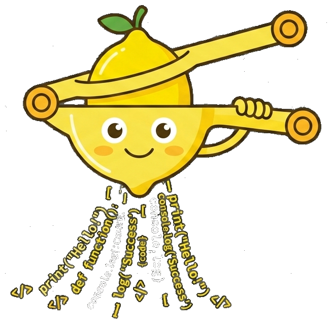
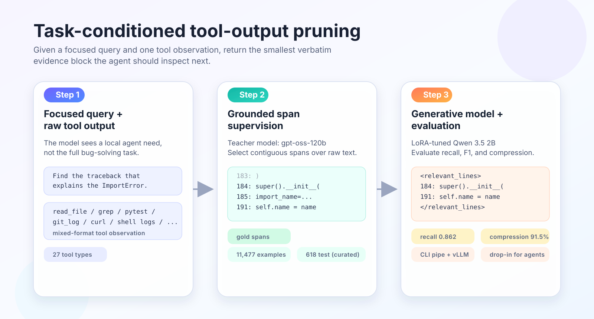
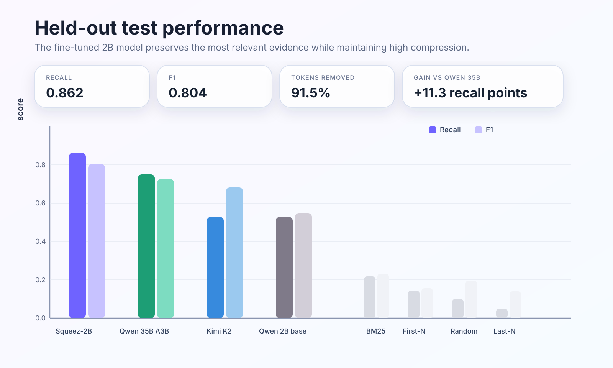
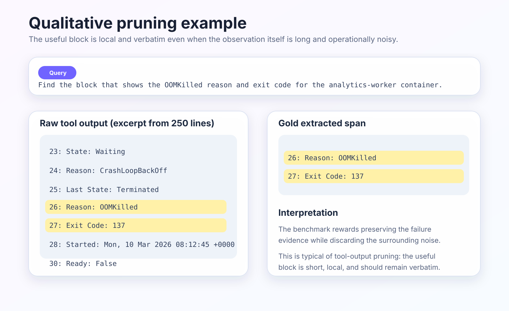

# Squeez: Task-Conditioned Tool-Output Pruning for Coding Agents

<p align="center">
  
</p>

We trained and open-sourced **Squeez-2B**, a compact model for pruning tool output in coding agents. Given a focused query and one raw tool observation, it returns the smallest verbatim evidence block that the agent should inspect next. On our held-out benchmark it reaches **0.86 recall at 92% compression**, outperforming a zero-shot **Qwen 3.5 35B A3B** baseline by **11 recall points** at essentially the same compression level. The model, dataset, and code are released on [Hugging Face](https://huggingface.co/KRLabsOrg/squeez-2b), [the dataset hub](https://huggingface.co/datasets/KRLabsOrg/tool-output-extraction-swebench), and [GitHub](https://github.com/KRLabsOrg/squeez).

This post explains the problem, describes how we built the benchmark, and shows why narrow supervision works better here than larger zero-shot models or simple retrieval heuristics.

## The Problem

Coding agents such as Claude Code and Codex spend much of their time reading tool output. When an agent runs `pytest`, `grep`, `git log`, `kubectl`, or `pip install`, the result is often dozens or hundreds of lines long. Only a small fraction of those lines matter for the next step. The rest is headers, passing tests, repeated metadata, timestamps, unchanged context, or structurally similar but irrelevant matches. In practice, this means that a substantial part of the context budget is consumed not by reasoning, but by re-reading noisy observations.

This is easiest to see on test output. An agent runs `pytest`, receives a moderately long result, and only one failure block matters:

**Raw tool output (45 lines):**

```text
$ python -m pytest tests/ -v
======================== test session starts ===========
platform linux -- Python 3.12.1, pytest-8.1.1
collected 23 items

tests/test_auth.py::test_login_valid PASSED
tests/test_auth.py::test_login_invalid PASSED
tests/test_auth.py::test_token_refresh FAILED
tests/test_auth.py::test_logout PASSED
tests/test_users.py::test_create_user PASSED
  ... 6 more PASSED ...
tests/test_middleware.py::test_cors_headers PASSED

======================= FAILURES =======================
_____ test_token_refresh _______________________________

    def test_token_refresh(self):
        token = self.client.get_token(expired=True)
>       refreshed = self.client.refresh(token)
E       AuthenticationError: Token refresh window expired
E       Expected: new token within 30m window
E       Got: rejection after 15m (timeout changed?)

tests/test_auth.py:47: AuthenticationError
================ short test summary info ===============
FAILED tests/test_auth.py::test_token_refresh
================== 1 failed, 9 passed =================
```

**After Squeez (6 lines):**

```text
tests/test_auth.py::test_token_refresh FAILED

    def test_token_refresh(self):
        token = self.client.get_token(expired=True)
>       refreshed = self.client.refresh(token)
E       AuthenticationError: Token refresh window expired
E       Expected: new token within 30m window
E       Got: rejection after 15m (timeout changed?)
```

That is **87% compression** while preserving the only part of the observation that matters for the next debugging step:

```bash
python -m pytest tests/ -v 2>&1 | squeez "find the test failure related to authentication"
```

The same pattern appears in many other tools. `grep` may return a long list of nearby lexical matches although only one file is relevant. `git log` may show a long history where one commit matters. `kubectl describe` may contain hundreds of lines of pod state, yet the evidence is two lines saying `OOMKilled` and `Exit Code: 137`. `read_file` may return an entire module even though the agent only needs one code block. The common structure is always the same: a small evidence block embedded in a much larger observation.

Existing pruning systems point in the right direction, but usually operate on different units. **LLMLingua** and **LongLLMLingua** compress prompts at the token or prompt-block level ([Jiang et al., 2023](https://aclanthology.org/2023.emnlp-main.825/); [Jiang et al., 2024](https://aclanthology.org/2024.acl-long.91/)). **EXIT** and **Provence** perform extractive compression over retrieved text for downstream question answering or retrieval-augmented generation ([Hwang et al., 2025](https://aclanthology.org/2025.findings-acl.253/); [Chirkova et al., 2025](https://arxiv.org/abs/2501.16214)). **Zilliz Semantic Highlight** adapts this line to semantic highlighting over retrieved passages ([model card](https://huggingface.co/zilliz/semantic-highlight-bilingual-v1)). **SWE-Pruner** is the closest coding baseline, but it focuses on pruning repository code context rather than a single mixed-format tool observation ([Wang et al., 2026](https://arxiv.org/abs/2601.16746)).

Tool output is a different object. It is not well-formed prose, and it is not always source code. A single observation may mix code, logs, shell traces, stack frames, JSON payloads, and Git metadata. The relevant unit may be a failure block, a short function body, a commit entry, a package conflict, or nothing at all. That is the gap Squeez targets.

## The Task and the Benchmark

We formulate the problem as **task-conditioned tool-output pruning**: given a focused query and one raw tool observation, return the smallest verbatim evidence block that the agent should inspect next. The model is not asked to solve the full bug from one observation. It is asked to preserve the relevant evidence and remove the rest.

Two properties of the task matter. First, the output is **verbatim**. We do not want paraphrased summaries of stack traces, imports, versions, exit codes, or code blocks. Tool output often contains details that should remain exact. Second, the query is **task-conditioned** but narrower than the full issue description. It expresses the local information need the agent has at that moment: find the failure block, the relevant code region, or the commit that likely introduced the behavior.

The overall pipeline is shown below:

<p align="center">
  
</p>

The benchmark is built from two sources. The first is [SWE-bench](https://openreview.net/forum?id=VTF8yNQM66), which provides real GitHub issue-resolution tasks over real repositories. We clone repository snapshots and execute 14 tool types against them — file reads, grep, Git log and blame, test runners, linters, type checkers, package installation, curl, and others — collecting **10,713** raw observations that reflect the kind of output a coding agent encounters during issue resolution.

The second source is synthetic multi-ecosystem tool output, which extends coverage beyond SWE-bench's Python-heavy distribution. We use `openai/gpt-oss-120b` to generate **2,039** realistic tool outputs for representative tasks in TypeScript, Go, Rust, Java, Docker, Terraform, and Kubernetes workflows. We also construct explicit negatives by pairing mismatched queries and tool outputs, where the correct pruning decision is to return nothing.

The executed SWE-derived subset covers 14 tool types; the full released benchmark reaches 27 tool families once the synthetic multi-ecosystem portion is added.

Each released positive example is labeled with the same two-stage teacher pipeline, again using `openai/gpt-oss-120b`, regardless of whether it comes from SWE-bench or from the synthetic portion. First, the teacher writes a focused extraction query for one observation. Second, it selects the smallest contiguous span, or small set of spans, that answers that query. The teacher sees a numbered rendering of the output for stable span selection, but the released labels are always mapped back onto the original raw text. Positive examples whose query cannot be supported by the observation are dropped rather than retained as accidental empty outputs. Explicit negatives are created separately in the synthetic portion, where the correct target is an empty extraction.

The held-out set was also manually curated. Starting from **729** candidate test examples, we removed **111** cases (15.2%) that were near-duplicates, trivial 1--2 line outputs, overly broad spans, or incorrect annotations. The final test set contains **618** manually reviewed examples.

The released benchmark contains **11,477** examples in total: **9,205** SWE-derived examples, **1,697** synthetic positives, and **575** synthetic negatives. SWE-derived examples are split by repository and synthetic examples by tool family.

| Source | Raw inputs | Released rows |
|---|---:|---:|
| SWE-derived | 10,713 | 9,205 |
| Synthetic positives | 2,039 | 1,697 |
| Synthetic negatives | — | 575 |
| Total | 12,752 | 11,477 |

The benchmark covers **27** tool types. The largest families are shown below.

| Tool family | Rows | Avg. input | Avg. gold |
|---|---:|---:|---:|
| `read_file` | 3768 | 1677 | 84 |
| `grep` | 1330 | 779 | 19 |
| `git_log` | 720 | 161 | 11 |
| `python` | 698 | 60 | 28 |
| `test_output` | 546 | 56 | 23 |
| `curl` | 493 | 723 | 68 |
| `pip_install` | 441 | 438 | 79 |
| `type_check` | 317 | 3418 | 39 |
| `git_blame` | 291 | 4210 | 139 |
| remaining tools | 2873 | 688 | 47 |

The distribution is intentionally heterogeneous. `python` and `test_output` rows are short; `read_file`, `type_check`, and `git_blame` can be extremely long. This matters because the useful evidence does not follow one structural pattern, and it may occur at the beginning, middle, or end of the observation. That is also why simple truncation and lexical retrieval remain weak baselines here.

## Training a Small Model for a Narrow Task

We chose **Qwen 3.5 2B** as the base model ([Qwen3.5 blog post](https://qwen.ai/blog?id=qwen3.5)). The goal here is not to maximize zero-shot reasoning with the largest possible decoder. It is to learn a narrow supervised extraction policy that can run cheaply inside an agent loop. A 2B model is large enough to benefit from supervision, but still small enough to be practical for local serving and repeated tool use.

We fine-tuned the model with **LoRA** ([Hu et al., 2022](https://openreview.net/forum?id=nZeVKeeFYf9); [Dettmers et al., 2023](https://proceedings.neurips.cc/paper_files/paper/2023/hash/1feb87871436031bdc0f2beaa62a049b-Abstract-Conference.html)) using the **Unsloth** stack. The model receives a focused extraction query and the raw tool observation, and is trained to emit the extracted evidence wrapped in `<relevant_lines>` tags. In other words, the supervision target is not a classification label and not a summary. It is the exact evidence block the model should keep.

Training uses max sequence length 20,000, effective batch size 32, learning rate 2e-4, 3 epochs, warmup 0.05, weight decay 0.01. After training, we merge the LoRA adapter into the base model and serve the merged checkpoint through **vLLM**.

## Results

We compare Squeez-2B against three zero-shot generative baselines and four heuristic baselines. The heuristic baselines keep roughly 10% of the input lines to operate at a compression level similar to the gold extractions. The main metrics are **recall**, **F1**, and **compression**. Recall matters most because dropping relevant evidence is usually more harmful than keeping a slightly larger block.

| Model | Recall | F1 | Compression |
|---|---:|---:|---:|
| **Squeez-2B** | **0.86** | **0.80** | 0.92 |
| Qwen 3.5 35B A3B | 0.75 | 0.73 | 0.92 |
| Kimi K2 | 0.53 | 0.68 | 0.94 |
| Qwen 3.5 2B (base) | 0.53 | 0.55 | 0.82 |
| BM25 (10%) | 0.22 | 0.23 | 0.90 |
| First-N (10%) | 0.14 | 0.16 | 0.91 |
| Random (10%) | 0.10 | 0.20 | 0.91 |
| Last-N (10%) | 0.05 | 0.14 | 0.91 |

Three results matter most. First, **task-specific training matters**: a fine-tuned 2B model outperforms the 18x larger Qwen 3.5 35B A3B by **11 recall points** at almost the same compression level. Second, **heuristics are not sufficient**: BM25 reaches only **0.22 recall**, because lexical overlap is a poor proxy for relevance in stack traces, logs, and mixed-format observations. Third, **aggressive compression alone is not enough**: Kimi K2 removes the largest fraction of tokens, but pays for that compression with a large recall drop.

The recall-compression trade-off is shown below. Squeez-2B occupies the upper-left region: high recall with strong compression.

<p align="center">
  
</p>

The aggregate numbers are only part of the story. Below are four qualitative patterns from the held-out test set.

**Precise selection in structured output.** In `grep` and `git_log`, the fine-tuned model learns to return the single relevant hit. Here is a 21-line `git_log` where the task is to find the commit that changed the dimension order of `xr.polyval` output:

```
fc282d59 re-add timedelta support for polyval (#6599)
cad4474a Fix polyval overloads (#6593)
6fbeb131 polyval: Use Horner's algorithm + support chunked inputs (#6548)  ← gold
07de257c Simplify transpose in xr.dot (#5849)
... 17 more lines ...
```

| Model | Prediction | Correct? |
|---|---|---|
| **Squeez-2B** | `6fbeb131 polyval: Use Horner's algorithm...` | Yes |
| Qwen 3.5 35B A3B | `07de257c Simplify transpose in xr.dot` | No (wrong commit) |
| Qwen 3.5 2B (base) | 3 polyval commits (over-selects) | Partial |

Squeez picks the exact commit. Qwen 35B picks a plausible but wrong commit about transpose — right neighborhood, wrong entry.

**Failure-block extraction in logs.** This 176-line service log contains **two** separate TLS handshake failures at different timestamps. The query asks for the health-check failure:

```
... 40 lines of startup logs ...
10:00:00.240 [ERROR] TLS handshake failed: certificate verify failed     ← gold
10:00:00.241 [ERROR] node-fetch: request to .../status failed            ← gold
10:00:00.260 [WARN]  Health check #1 failed (TLS error)                  ← gold
... 80 lines of normal operation ...
10:00:21.165 [ERROR] TLS handshake failed: certificate verify failed     ← wrong block
10:00:21.166 [ERROR] node-fetch: request to .../pay failed               ← wrong block
... 50 more lines ...
```

| Model | Prediction | Correct? |
|---|---|---|
| **Squeez-2B** | Health-check TLS block (10:00:00) | Yes |
| Qwen 3.5 35B A3B | Payment TLS block (10:00:21) | No (wrong timestamp) |
| Kimi K2 | Health-check TLS block (10:00:00) | Partial (3 of 5 lines) |

Qwen 35B selects a semantically similar but wrong block from a later request. This "right pattern, wrong instance" failure is common among zero-shot models on repetitive log output.

**Correct empty predictions.** On negative examples where the tool output does not contain the requested evidence, Squeez correctly returns nothing. In a 316-line `docker_logs` output, the query asks about a numpy version conflict between torch and tensorflow — but no such conflict exists. Squeez returns empty output; Qwen 35B generates "No relevant lines found..." (not verbatim tool output); the 2B base returns unrelated database errors. On the 59 negative examples in the test set, Squeez-2B correctly returns empty 80% of the time. Kimi K2 matches this (81%), likely because its aggressive compression tends toward empty output. Qwen 35B returns empty only 7% of the time.

**The kubectl example** illustrates the intended use case at a glance. The full observation contains 250 lines of pod description; the relevant evidence is a two-line block reporting `OOMKilled` and the exit code.

<p align="center">
  
</p>

**Remaining errors.** The strongest failures of Squeez-2B are semantically adjacent but incorrect selections. In a build log containing both a Dockerfile syntax error and a Python `SyntaxError`, Squeez correctly finds the Dockerfile error but also includes the nearby Python error. Qwen 35B picks *only* the Python error and misses the Dockerfile error entirely. This pattern — correct evidence plus some extra noise — accounts for most of the gap between Squeez's 0.86 recall and its 0.80 precision.

## Using Squeez

Operationally, Squeez is meant to be a preprocessing step rather than a new agent architecture. It does not require changes to the planner, tool API, or interaction loop. You can pipe tool output through the CLI:

```bash
pytest -q 2>&1 | squeez "find the failure block"
git log --oneline -50 | squeez "find the commit that changed CSRF handling"
cat src/auth/middleware.py | squeez "find the referer validation logic"
```

Or you can serve the model with vLLM for higher-throughput settings:

```bash
vllm serve KRLabsOrg/squeez-2b --dtype bfloat16 --max-model-len 16384
export SQUEEZ_SERVER_URL=http://localhost:8000/v1
pytest -q 2>&1 | squeez "find the failure block"
```

For systems such as Claude Code, a minimal `CLAUDE.md` instruction is enough:

```text
When you invoke a shell command, pipe it through `squeez` and describe what you need.
Examples:
- `bun test 2>&1 | squeez "did the tests pass?"`
- `git log --oneline -50 | squeez "find the commit that broke CSRF"`
```

The same pattern works with Codex and other agent setups that accept system-level instructions or shell wrappers.

## Closing Remarks

One recurring bottleneck in coding agents is deciding what to keep from a single tool observation. Our results suggest that this bottleneck is both measurable and learnable: mixed-format tool output is not handled well by simple heuristics or larger zero-shot models alone, but it responds well to narrow supervision. That is the main claim behind Squeez. It is a small model for a small problem, but the problem turns out to matter.

## Resources

- **Model:** [KRLabsOrg/squeez-2b](https://huggingface.co/KRLabsOrg/squeez-2b) (Apache 2.0)
- **Dataset:** [KRLabsOrg/tool-output-extraction-swebench](https://huggingface.co/datasets/KRLabsOrg/tool-output-extraction-swebench) (Apache 2.0)
- **Code & CLI:** [github.com/KRLabsOrg/squeez](https://github.com/KRLabsOrg/squeez) (Apache 2.0)

## References

- Hu, E. J., et al. (2022). *LoRA: Low-Rank Adaptation of Large Language Models*. [ICLR](https://openreview.net/forum?id=nZeVKeeFYf9)
- Dettmers, T., et al. (2023). *QLoRA: Efficient Finetuning of Quantized LLMs*. [NeurIPS](https://proceedings.neurips.cc/paper_files/paper/2023/hash/1feb87871436031bdc0f2beaa62a049b-Abstract-Conference.html)
- Jiang, H., et al. (2023). *LLMLingua: Compressing Prompts for Accelerated Inference of Large Language Models*. [EMNLP](https://aclanthology.org/2023.emnlp-main.825/)
- Jiang, H., et al. (2024). *LongLLMLingua: Accelerating and Enhancing LLMs in Long Context Scenarios via Prompt Compression*. [ACL](https://aclanthology.org/2024.acl-long.91/)
- Hwang, T., et al. (2025). *EXIT: Context-Aware Extractive Compression for Enhancing Retrieval-Augmented Generation*. [Findings of ACL](https://aclanthology.org/2025.findings-acl.253/)
- Chirkova, N., et al. (2025). *Provence: Efficient and Robust Context Pruning for Retrieval-Augmented Generation*. [ICLR](https://arxiv.org/abs/2501.16214)
- Zilliz. (2025). *Semantic Highlight Bilingual v1*. [Model card](https://huggingface.co/zilliz/semantic-highlight-bilingual-v1)
- Kerboua, I., et al. (2025). *FocusAgent: Simple Yet Effective Ways of Trimming the Large Context of Web Agents*. [arXiv](https://arxiv.org/abs/2510.03204)
- Wang, Y., et al. (2026). *SWE-Pruner: Self-Adaptive Context Pruning for Coding Agents*. [arXiv](https://arxiv.org/abs/2601.16746)
- Kovacs, A., Schmitt, P., Recski, G. (2025). *KR Labs at ArchEHR-QA 2025: A Verbatim Approach for Evidence-Based Question Answering*. [BioNLP Workshop](https://aclanthology.org/2025.bionlp-share.8/)
- Jimenez, C. E., et al. (2024). *SWE-bench: Can Language Models Resolve Real-World GitHub Issues?* [ICLR](https://openreview.net/forum?id=VTF8yNQM66)
- Qwen Team. (2026). *Qwen3.5: Towards Native Multimodal Agents*. [Blog post](https://qwen.ai/blog?id=qwen3.5)
